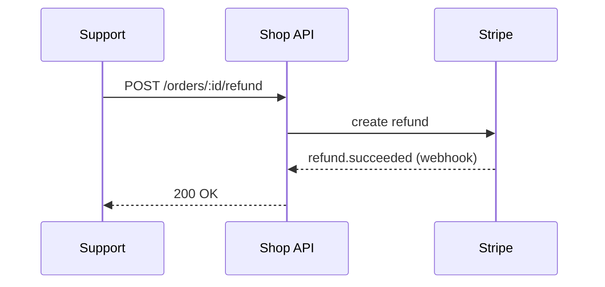

# Refund sequence

Refunds are always started by support, never by the customer.

```mermaid
sequenceDiagram
  participant Support
  participant API as Shop API
  participant Stripe
  Support->>API: POST /orders/:id/refund
  API->>Stripe: create refund
  Stripe-->>API: refund.succeeded (webhook)
  API-->>Support: 200 OK
```
